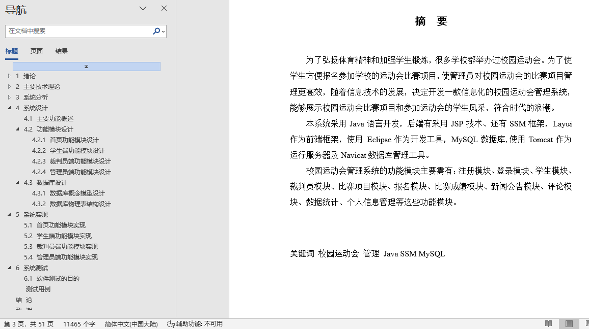
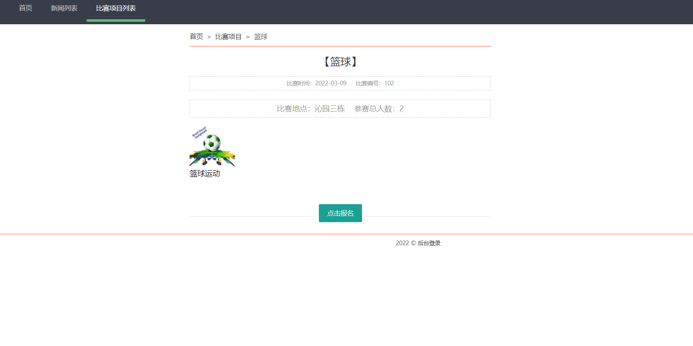
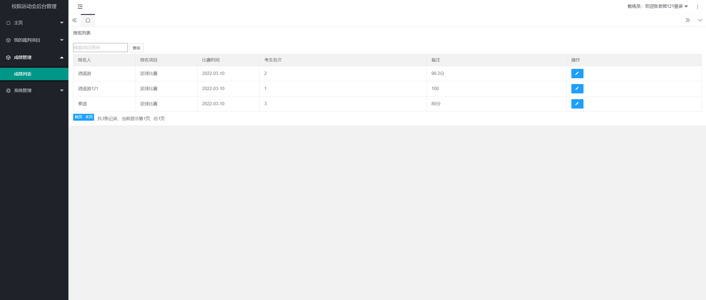
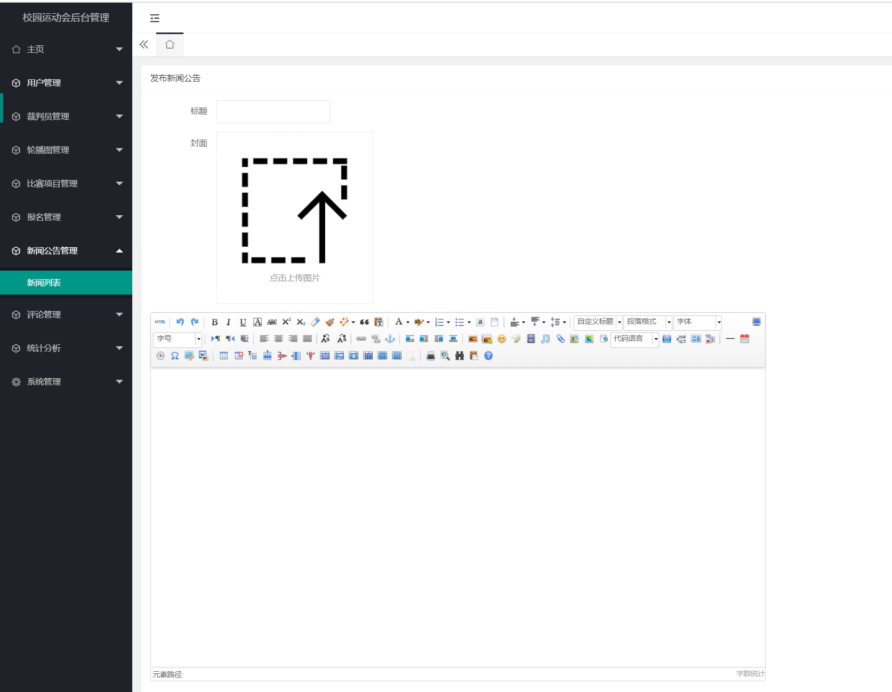
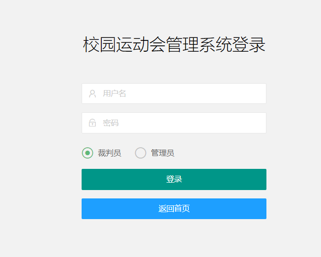
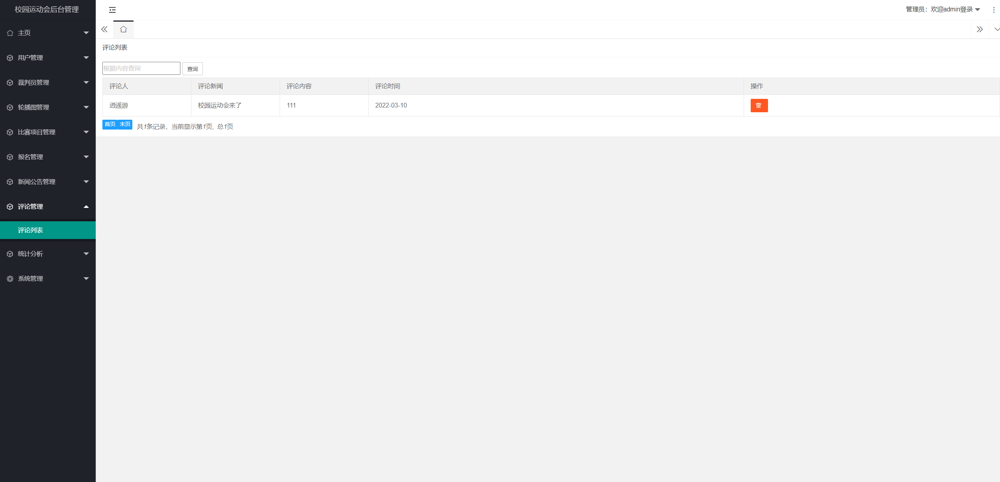
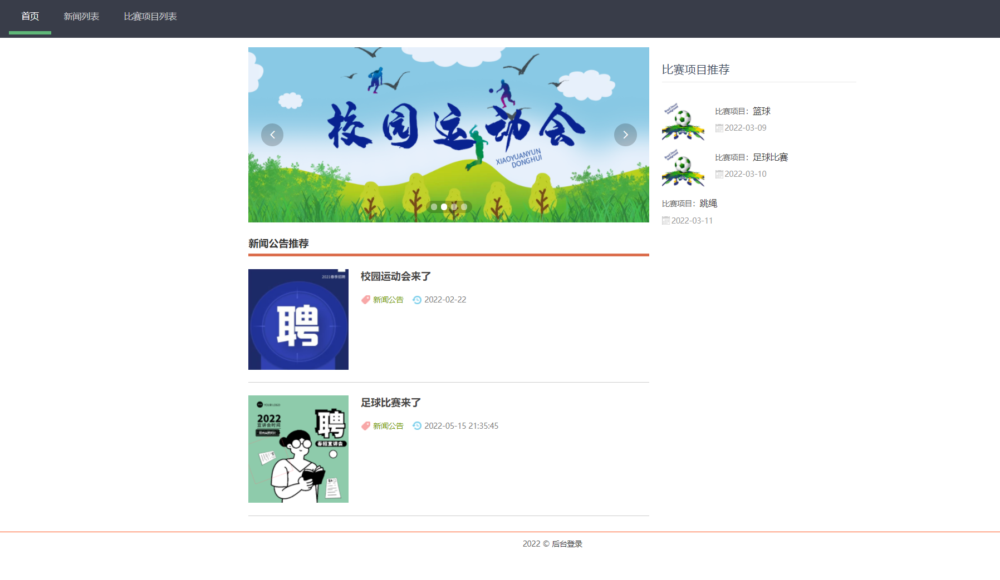
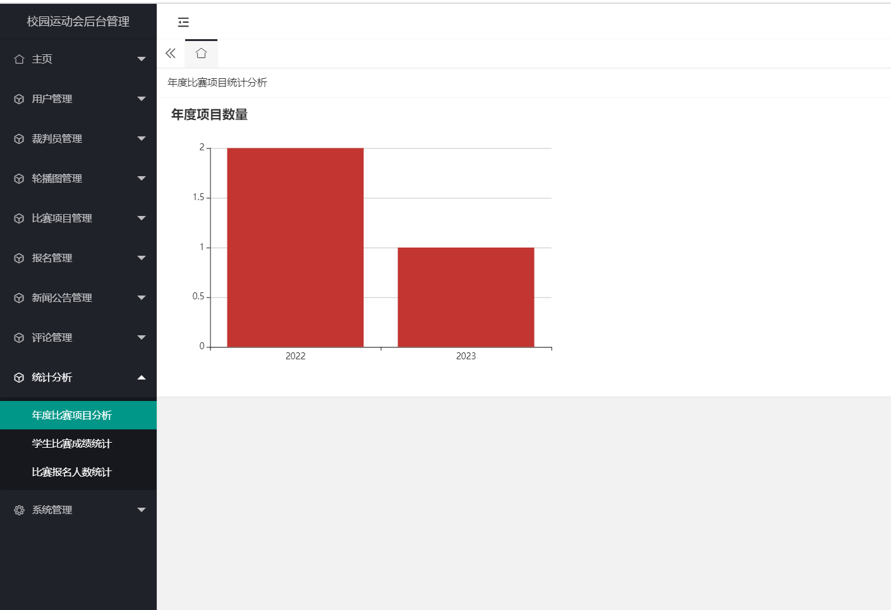
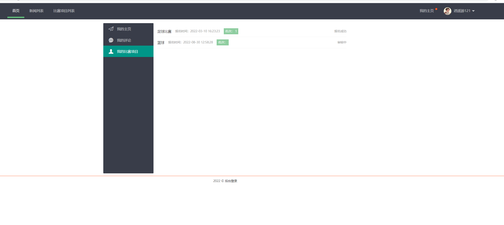
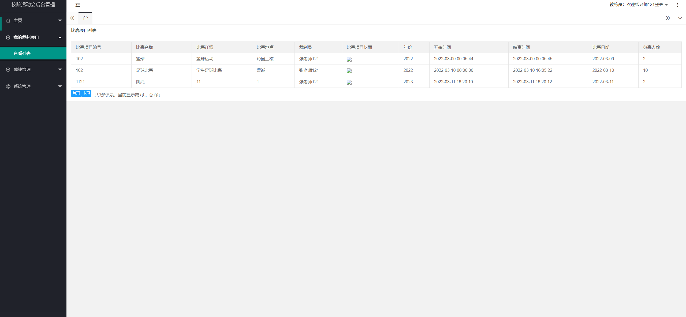

## 基于SSM的校园运动会管理系统(程序+报告)

###  获取sql数据库文件: 从戎源码网 (https://armycodes.com/) QQ: 386869957 QQ群: 377586148
###  所有系统地址: (https://github.com/YuLin-Coder/AllProjectCatalog) 
###  所有项目以及源代码本人均调试运行无问题 可支持远程安装部署调试、定制修改、代码讲解

## 项目介绍
基于SSM的校园运动会管理系统，包含三种角色：管理员、学生、教练,系统分为前台和后台两大模块，主要功能如下。

【学生】：
1. 注册：学生可以通过系统进行注册，输入个人信息并创建账号。
2. 登录：学生可以使用注册的账号进行系统登录。
3. 我的主页：学生可以查看个人信息、参加的比赛项目和成绩等。
4. 我的评论：学生可以对比赛项目进行评论和评价。
5. 比赛项目和成绩：学生可以查看校园运动会的比赛项目和自己的成绩。

【裁判员】：
1. 登录：裁判员可以使用注册的账号进行系统登录。
2. 我的裁判项目：裁判员可以查看自己负责的裁判项目。
3. 成绩管理：裁判员可以对比赛项目的成绩进行录入和管理。
4. 个人信息管理：裁判员可以修改自己的个人信息。

【管理员】：
1. 登录：管理员可以使用注册的账号进行系统登录。
2. 学生管理：管理员可以管理学生信息，包括添加、编辑和删除学生信息。
3. 裁判员管理：管理员可以管理裁判员信息，包括添加、编辑和删除裁判员信息。
4. 新闻公告管理：管理员可以发布和管理系统的新闻公告。
5. 比赛项目管理：管理员可以管理比赛项目，包括添加、编辑和删除比赛项目。
6. 数据统计：管理员可以对校园运动会的数据进行统计和分析。
7. 评论管理：管理员可以管理学生的评论，包括删除不当评论等操作。
8. 个人信息管理：管理员可以修改自己的个人信息。

## 项目技术
- 编程语言：Java
- 数据库：MySQL
- 前端技术：JSP、Jquery、Layui、ECharts
- 后端技术：Spring、SpringMVC、MyBatis

## 运行环境
- JDK版本：JDK1.8及以上
- 开发工具：IDEA、Ecplise、Myecplise都可以
- 数据库: MySQL5.7及以上

## 运行截图

